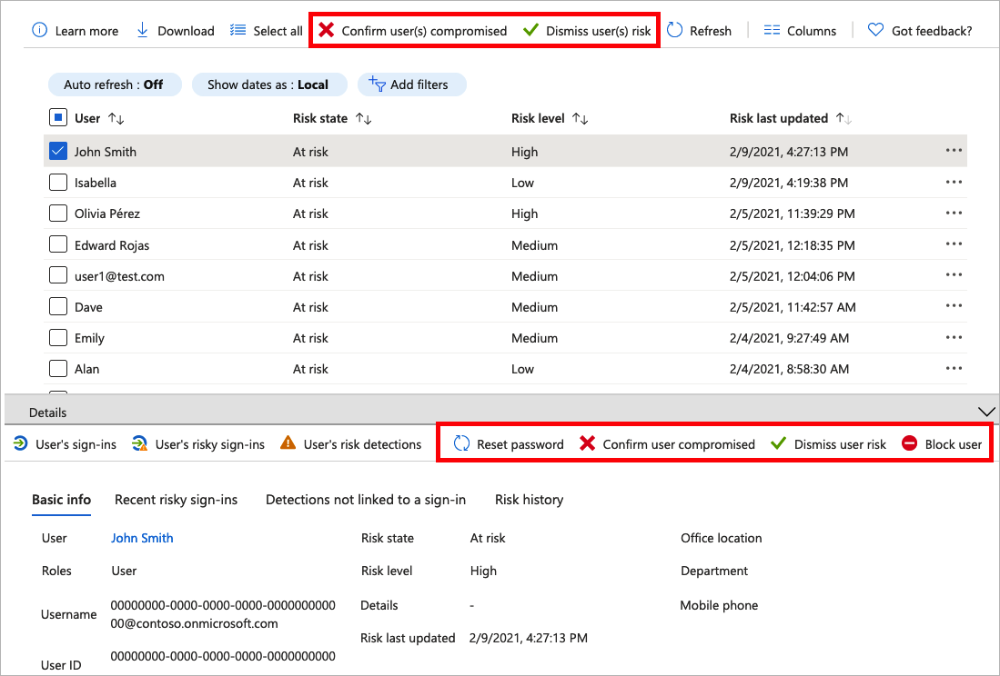
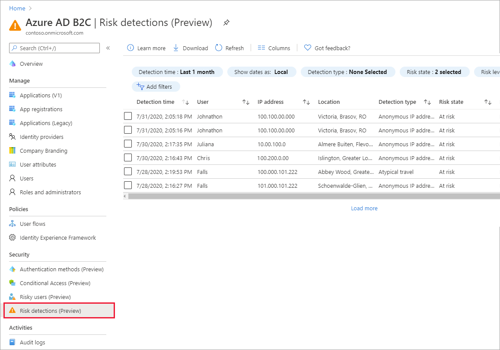

# Investigación del riesgo con Identity Protection en Azure AD B2C

[!INCLUDE [b2c-public-preview-feature](../../includes/active-directory-b2c-public-preview.md)]

Identity Protection proporciona detección continua de riesgos para el inquilino de Azure AD B2C. Permite a las organizaciones detectar, investigar y corregir los riesgos basados en la identidad. Identity Protection incluye informes de riesgo que se pueden usar para investigar los riesgos de identidad en los inquilinos de Azure AD B2C. En este artículo, aprenderá a investigar y mitigar los riesgos.

## Información general

Azure AD B2C Identity Protection proporciona dos informes. El informe de *usuarios de riesgo* es el lugar en que los administradores pueden encontrar qué usuarios están en riesgo, así como detalles sobre las detecciones. El informe de *detecciones de riesgo* proporciona información acerca de la detección de riesgos, lo que incluye el tipo, otros riesgos desencadenados al mismo tiempo, la ubicación de intento de inicio de sesión, etc.

Cada informe se inicia con una lista de todas las detecciones correspondientes al período mostrado en la parte superior del informe. Los informes se pueden filtrar con los filtros de la parte superior del informe. Los administradores pueden optar por descargar los datos o usar [MS Graph API y el SDK de PowerShell de Microsoft Graph](../active-directory/identity-protection/howto-identity-protection-graph-api.md) para exportar los datos continuamente.

## Limitaciones y consideraciones del servicio

Si usa Identity Protection, tenga en cuenta lo siguiente:

- Identity Protection está activado de forma predeterminada.
- Identity Protection está disponible para identidades tanto locales como sociales, como Google o Facebook. En el caso de las identidades sociales, se debe activar el acceso condicional. La detección es limitada porque el proveedor de identidades externas administra las credenciales de la cuenta social.
- En los inquilinos de Azure AD B2C solo está disponible un subconjunto de las [detecciones de riesgo de Azure AD Identity Protection](../active-directory/identity-protection/overview-identity-protection.md). Azure AD B2C admite las siguientes detecciones de riesgo:  

|Tipo de detección de riesgo  |Descripción  |
|---------|---------|
| Viaje atípico     | Inicio de sesión desde una ubicación atípica basado en los inicios de sesión recientes del usuario.        |
|Dirección IP anónima     | Inicio de sesión desde una dirección IP anónima (por ejemplo: el explorador Tor o VPN anonimizadoras).        |
|Dirección IP vinculada al malware     | Inicio de sesión desde una dirección IP vinculada al malware.         |
|Propiedades de inicio de sesión desconocidas     | Inicio de sesión con propiedades que no hemos observado recientemente para el usuario dado.        |
|Vulneración de identidad de usuario confirmada por el administrador    | Un administrador ha indicado que se ha vulnerado la identidad de un usuario.             |
|Difusión de contraseña     | Inicio de sesión mediante un ataque de difusión de contraseña.      |
|Inteligencia de Azure AD sobre amenazas     | Los orígenes de inteligencia sobre amenazas internas y externas de Microsoft han identificado un patrón de ataque conocido.        |

## Plan de tarifa

Azure AD B2C Premium P2 es necesario para algunas características de Identity Protection. Si es necesario, [cambie el plan de tarifa de Azure AD B2C a Premium P2](./billing.md). En la tabla siguiente se resumen las características de Identity Protection y el plan de tarifa necesario.  

|Característica   |P1   |P2|
|----------|:-----------:|:------------:|
|Informe de usuarios de riesgo     |&#x2713; |&#x2713; |
|Detalles del informe de usuarios de riesgo  | |&#x2713; |
|Corrección del informe de usuarios de riesgo    | &#x2713; |&#x2713; |
|Informe de detecciones de riesgo   |&#x2713;|&#x2713;|
|Detalles del informe de detecciones de riesgo  ||&#x2713;|
|Descarga del informe |  &#x2713;| &#x2713;|
|Acceso a MS Graph API |  &#x2713;| &#x2713;|

## Prerrequisitos

[!INCLUDE [active-directory-b2c-customization-prerequisites](../../includes/active-directory-b2c-customization-prerequisites.md)]

## Investigación de usuarios de riesgo

Con la información que proporciona el informe de usuarios de riesgo, los administradores pueden buscar lo siguiente:

- El **estado de riesgo**, que muestra qué usuarios están **en riesgo**, si lo han **corregido** o lo han **descartado**.
- Detalles sobre las detecciones
- Historial de todos los inicios de sesión de riesgo
- Historial de riesgos
 
A continuación, los administradores pueden elegir tomar medidas en estos eventos. Los administradores pueden optar por:

- Restablecer la contraseña del usuario
- Confirmar el peligro del usuario
- Descartar el riesgo del usuario
- Bloquear el inicio de sesión del usuario
- Investigar con más detalle con Azure ATP

Un administrador puede optar por descartar el riesgo de un usuario en Azure Portal o mediante programación a través de [descartar el riesgo de un usuario](https://docs.microsoft.com/graph/api/riskyusers-dismiss?view=graph-rest-beta&preserve-view=true) de Microsoft Graph API. Se requieren privilegios de administrador para descartar el riesgo de un usuario. La corrección de un riesgo la puede realizar el usuario de riesgo o un administrador en nombre del usuario, por ejemplo, a través de un restablecimiento de contraseña.

### Desplazarse por el informe de usuarios de riesgo

1. Inicie sesión en [Azure Portal](https://portal.azure.com/).

1. Seleccione el icono **Directorio y suscripción** en la barra de herramientas del portal y, luego, elija el directorio que contiene el inquilino de Azure AD B2C.

1. En **Servicios de Azure**, seleccione **Azure AD B2C**. O bien, use el cuadro de búsqueda para buscar y seleccionar **Azure AD B2C**.

1. En **Seguridad**, seleccione **Usuarios de riesgo (versión preliminar)** .

   

    La selección de entradas individuales expande una ventana de detalles debajo de las detecciones. La vista de detalles permite a los administradores investigar y realizar acciones en cada detección.

    

## Informe de detecciones de riesgo

El informe de detecciones de riesgo contiene datos que se pueden filtrar de los últimos 90 días (tres meses).

Con la información que proporciona el informe de detecciones de riesgo, los administradores pueden buscar lo siguiente:

- Información sobre cada detección de riesgo, incluido el tipo.
- Otros riesgos desencadenados al mismo tiempo.
- Ubicación del intento de inicio de sesión.

Los administradores pueden elegir volver al informe de riesgo del usuario o de inicios de sesión para realizar acciones en función de la información recopilada.

### Desplazamiento hasta el informe de detecciones de riesgo

1. En Azure Portal, busque y seleccione **Azure AD B2C**.
1. En **Seguridad**, seleccione **Detecciones de riesgos (versión preliminar)** .

   

## Pasos siguientes

- [Adición del acceso condicional a un flujo de usuario](conditional-access-user-flow.md).
