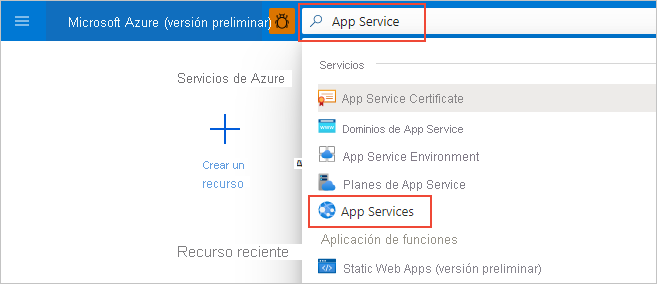
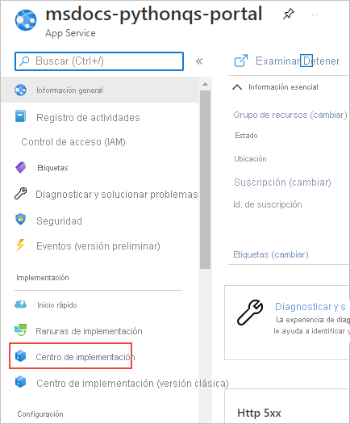

# Inicio rápido: Creación de una aplicación de Python mediante Azure App Service en Linux (Azure Portal)

En este inicio rápido se implementa una aplicación web de Python en [App Service en Linux](overview.md#app-service-on-linux), un servicio de Azure de hospedaje de sitios web muy escalable y con aplicación automática de revisiones. Para implementar un ejemplo se usa Azure Portal con los marcos Flask o Django. La aplicación web que se va a configurar usa un nivel de App Service básico que incurre en un pequeño costo en la suscripción de Azure.

## Configuración de cuentas

- Si aún no tiene una cuenta de Azure con una suscripción activa, [cree una cuenta gratuita](https://azure.microsoft.com/free/?ref=microsoft.com&utm_source=microsoft.com&utm_medium=docs&utm_campaign=visualstudio).

- Si no tiene cuenta de GitHub, visite [github.com](https://github.com) para crear una. 

## Bifurcación del repositorio de GitHub de ejemplo

1. Abra [github.com](https://github.com) e inicie sesión.

1. Vaya a uno de los siguientes repositorios de ejemplo:
    - [Flask Hello World](https://github.com/Azure-Samples/python-docs-hello-world)
    - [Django Hello World](https://github.com/Azure-Samples/python-docs-hello-django)

1. En la esquina superior derecha de la página de GitHub, seleccione **Fork** (Bifurcar) para crear una copia del repositorio en su propia cuenta de GitHub:

    

    Azure requiere que tenga acceso a la organización de GitHub que contiene el repositorio. Al bifurcar el ejemplo a su propia cuenta de GitHub, tendrá automáticamente el acceso necesario y podrá realizar cambios en el código.

## Aprovisionamiento de la aplicación web de App Service

Una aplicación web de App Service es el servidor web en el que se implementa el código.

1. Vaya a Azure Portal en [https://portal.azure.com](https://portal.azure.com) e inicie sesión si es necesario.

1. En la barra de búsqueda de la parte superior de Azure Portal, escriba "App Service" y seleccione **App Services**.

    

1. En la página **App Services**, seleccione **+ Agregar**:

    

1. En la página **Crear aplicación web**, realice las acciones siguientes:
    
    | Campo | Acción |
    | --- | --- |
    | Subscription | Seleccione la suscripción de Azure que quiere usar. |
    | Grupo de recursos | Seleccione **Crear** debajo de la lista desplegable. En el menú emergente, escriba "AppService-PythonQuickstart" y seleccione **Aceptar**. |
    | Nombre | Escriba un nombre único en todo Azure, normalmente con una combinación de nombres personales o de la empresa, como *contoso-testapp-123*. |
    | Publicar | Seleccione **Código**. |
    | Pila en tiempo de ejecución | Seleccione **Python 3.8**. |
    | Sistema operativo | Seleccione **Linux** (Python solo se admite en Linux). |
    | Region | Seleccione una región cerca de usted. |
    | Plan de Linux | Seleccione un plan de App Service existente o use **Crear** para crear uno. Se recomienda usar el plan **Básico  B1**. |

    

1. En la parte inferior de la página, seleccione **Revisar y crear**, revise los detalles y seleccione **Crear**.

1. Una vez completado el aprovisionamiento, seleccione **Ir al recurso** para ir a la nueva página de App Service. En este momento la aplicación web contiene solo una página predeterminada, por lo que en el paso siguiente se implementa código de ejemplo.

¿Tiene problemas? [Póngase en contacto con nosotros](https://aka.ms/FlaskPortalQuickstartHelp).

## Implementación del código de ejemplo

1. En la página de la aplicación web en Azure Portal, seleccione **Centro de implementación**:
    
    

1. En la página **Centro de implementación**, seleccione la pestaña **Configuración** si aún no está abierta:

    

1. En **Origen**, seleccione **GitHub** y, en el formulario de **GitHub** que aparece, realice las siguientes acciones:

    | Campo | Acción |
    | --- | --- |
    | Sesión iniciada como | Si aún no ha iniciado sesión en GitHub, hágalo ahora o seleccione **Cambiar cuenta* si es necesario. |
    | Organización | Seleccione la organización GitHub, si es necesario. |
    | Repositorio | Seleccione el nombre del repositorio de ejemplo que ha bifurcado anteriormente, ya sea **python-docs-hello-world** (Flask) o **python-docs-hello-django** (Django). |
    | Rama | Seleccione **main** (principal). |

    

1. En la parte superior de la página, seleccione **Guardar** para aplicar la configuración:

    

1. Seleccione la pestaña **Registros** para ver el estado de la implementación. El ejemplo tarda unos minutos en crearse e implementarse; otros registros aparecerán durante el proceso. Al finalizar, los registros deben reflejar el estado **Success (Active)** (Correcto [Activo]):

    

¿Tiene problemas? [Póngase en contacto con nosotros](https://aka.ms/FlaskPortalQuickstartHelp).

## Navegación hasta la aplicación

1. Una vez completada la implementación, seleccione **Información general** en el menú de la izquierda para volver a la página principal de la aplicación web.

1. Seleccione la **dirección URL** que contiene la dirección de la aplicación web:

    

1. Compruebe que la salida de la aplicación es "Hello, World!":

    

¿Tiene problemas? Consulte primero la [Guía de solución de problemas](configure-language-python.md#troubleshooting) y, si eso no funciona, [háganoslo saber](https://aka.ms/FlaskPortalQuickstartHelp).

## Cambio y reimplementación

Dado que se ha conectado App Service al repositorio, los cambios que se confirman en el repositorio de origen se implementan automáticamente en la aplicación web.

1. Puede realizar cambios directamente en el repositorio bifurcado en GitHub, o bien, puede clonar el repositorio en el entorno local, realizar y confirmar los cambios y, a continuación, enviarlos a GitHub. Cualquier método genera un cambio en el repositorio conectado a App Service.

1. **En el repositorio bifurcado**, cambie el mensaje de la aplicación de "Hello, World!" a "Hello Azure!" de la siguiente manera:
    - Flask (ejemplo de python-docs-hello-world): cambie la cadena de texto de la línea 6 del archivo *application.py*.
    - Django (ejemplo de python-docs-hello-django): cambie la cadena de texto de la línea 5 del archivo *views.py* dentro de la carpeta *hello*.

1. Confirme el cambio en el repositorio.

    Si usa un clon local, inserte también esos cambios en GitHub.

1. En Azure Portal de la aplicación web, vuelva a **Centro de implementación**, seleccione la pestaña **Registros** y anote la nueva actividad de implementación que debe estar en curso.

1. Una vez completada la implementación, vuelva a la página **Información general** de la aplicación web, abra de nuevo la dirección URL de la aplicación web y observe los cambios en la aplicación:

    

¿Tiene problemas? Consulte primero la [Guía de solución de problemas](configure-language-python.md#troubleshooting) y, si eso no funciona, [háganoslo saber](https://aka.ms/FlaskCLIQuickstartHelp).

## Limpieza de recursos

En los pasos anteriores creó recursos de Azure en un grupo de recursos denominado "AppService-PythonQuickstart", que se muestra en la página *Información general* de la aplicación web. Si mantiene la aplicación web en ejecución, se generarán costos continuos (consulte [Precios de App Service](https://azure.microsoft.com/pricing/details/app-service/linux/)).

Si cree que no necesitará estos recursos en el futuro, seleccione el nombre del grupo de recursos en la página **Información general** de la aplicación web para ir a la información general de los grupos de recursos. Seleccione **Eliminar grupo de recursos** y siga las instrucciones.

¿Tiene problemas? [Póngase en contacto con nosotros](https://aka.ms/FlaskCLIQuickstartHelp).

## Pasos siguientes

> [!div class="nextstepaction"]
> [Tutorial: Aplicación web Python (Django) con PostgreSQL](/azure/developer/python/tutorial-python-postgresql-app-portal)

> [!div class="nextstepaction"]
> [Configuración de una aplicación de Python](configure-language-python.md)

> [!div class="nextstepaction"]
> [Incorporación del inicio de sesión de un usuario a una aplicación web de Python](../active-directory/develop/quickstart-v2-python-webapp.md)

> [!div class="nextstepaction"]
> [Tutorial: Ejecución de la aplicación Python en un contenedor personalizado](tutorial-custom-container.md)
