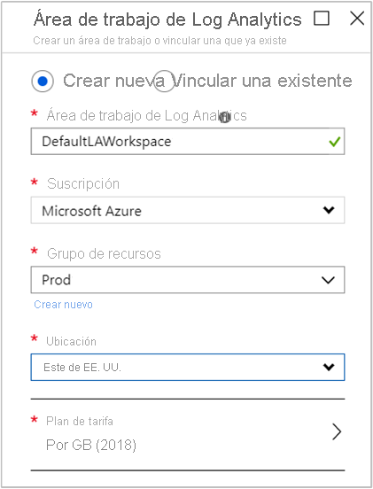
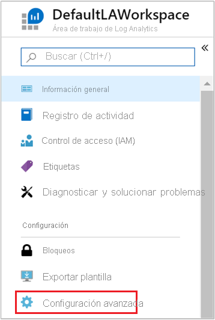
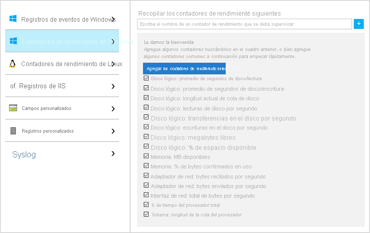
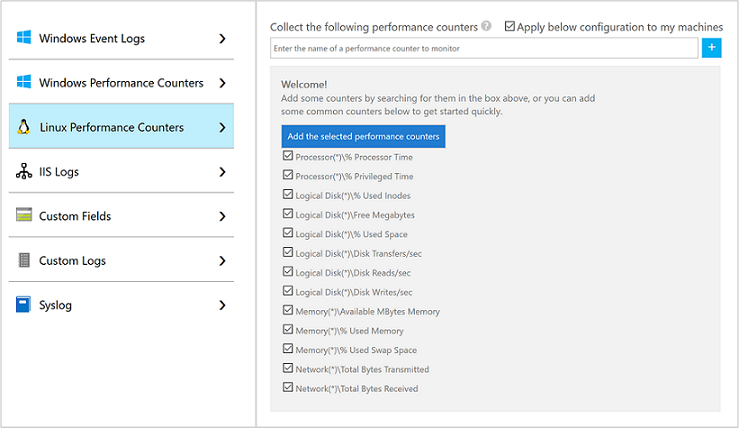
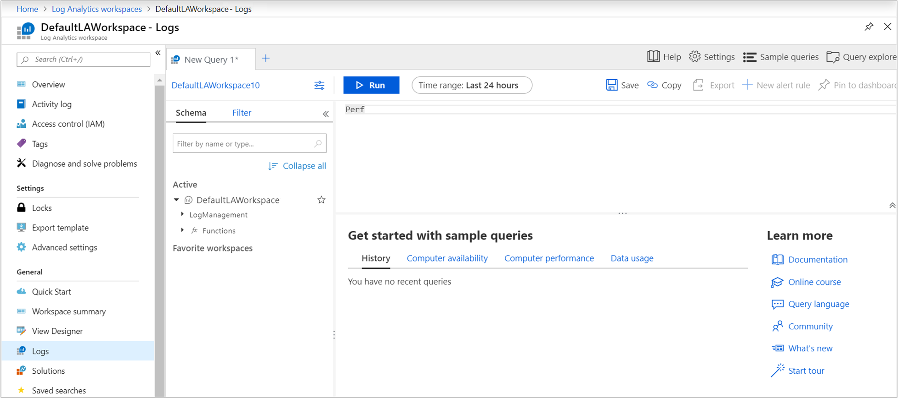

# Recopilación de datos de una máquina virtual de Azure con Azure Monitor

[Azure Monitor](../overview.md) puede recopilar datos directamente de las máquinas virtuales de Azure en un área de trabajo de Log Analytics para el análisis de los detalles y las correlaciones. La instalación de la extensión de máquina virtual de Log Analytics para [Windows](../../virtual-machines/extensions/oms-windows.md) y [Linux](../../virtual-machines/extensions/oms-linux.md) permite a Azure Monitor recopilar datos de las máquinas virtuales de Azure. En este inicio rápido se muestra cómo configurar y recopilar datos de máquinas virtuales Linux o Windows de Azure mediante la extensión de máquina virtual con unos pasos sencillos.  
 
En esta guía de inicio rápido se da por supuesto que tiene una máquina virtual de Azure. De no ser así, puede [crear una VM Windows](../../virtual-machines/windows/quick-create-portal.md) o [Linux](../../virtual-machines/linux/quick-create-cli.md) con los pasos que se describen en nuestras guías de inicio rápido para VM.

## Inicio de sesión en Azure Portal

Inicie sesión en Azure Portal en [https://portal.azure.com](https://portal.azure.com). 

## Crear un área de trabajo

1. En Azure Portal, seleccione **Todos los servicios**. En la lista de recursos, escriba **Log Analytics**. Cuando comience a escribir, la lista se filtrará en función de la entrada. Seleccione **Áreas de trabajo de Log Analytics**.

       

2. Seleccione **Crear** y, después, seleccione opciones para los elementos siguientes:

   * Proporcione el nombre de la nueva **área de trabajo de Log Analytics** como, por ejemplo, *DefaultLAWorkspace*.  
   * Seleccione una **suscripción** a la que vincularlo en la lista desplegable si la opción predeterminada seleccionada no es adecuada.
   * Para **Grupo de recursos**, seleccione un grupo de recursos existente que contenga una o más máquinas virtuales de Azure.  
   * Seleccione la **Ubicación** en que están implementadas las VM.  Para obtener más información, consulte en qué [regiones está disponible Log Analytics](https://azure.microsoft.com/regions/services/).
   * Si va a crear un área de trabajo en una nueva suscripción creada después del 2 de abril de 2018, esta utilizará automáticamente el plan de precios *Por GB* y la opción para seleccionar un plan de tarifas no estará disponible.  Si va a crear un área de trabajo para una suscripción existente creada antes del 2 de abril o para una suscripción asociada a una inscripción de EA existente, seleccione el plan de tarifa que prefiera.  Para obtener más información sobre planes concretos, consulte los [detalles de precios de Log Analytics](https://azure.microsoft.com/pricing/details/log-analytics/).
  
         

3. Después de proporcionar la información necesaria en el panel **Área de trabajo de Log Analytics**, seleccione **Aceptar**.  

Mientras se comprueba la información y se crea el espacio de trabajo, puede realizar un seguimiento de su progreso en **Notificaciones** en el menú. 

## Habilitar la extensión de VM de Log Analytics

[!INCLUDE [log-analytics-agent-note](../../../includes/log-analytics-agent-note.md)] 

Para máquinas virtuales Windows y Linux ya implementadas en Azure, instale el agente de Log Analytics con la extensión de VM de Log Analytics. El uso de una extensión simplifica el proceso de instalación y configura automáticamente el agente para enviar datos al área de trabajo de Log Analytics que especifique. El agente también se actualiza automáticamente cuando se lanza una nueva versión, lo que garantiza que disponga de las características y correcciones más recientes. Antes de continuar, compruebe que se está ejecutando la máquina virtual; de lo contrario, no podrá finalizar correctamente el proceso.  

>[!NOTE]
>No se puede configurar el agente de Log Analytics para Linux para informar a varias áreas de trabajo de Log Analytics. 

1. En Azure Portal, seleccione **Todos los servicios** en la esquina superior izquierda. En la lista de recursos, escriba **Log Analytics**. Cuando comience a escribir, la lista se filtrará en función de la entrada. Seleccione **Áreas de trabajo de Log Analytics**.

2. En la lista de áreas de trabajo de Log Analytics, seleccione *DefaultLAWorkspace* (creada antes).

3. En el menú izquierdo, en Orígenes de datos del área de trabajo, seleccione **Máquinas virtuales**.  

4. En la lista de **Máquinas virtuales**, seleccione la máquina virtual en la que quiera instalar el agente. Tenga en cuenta que el **estado de la conexión de Log Analytics** de la máquina virtual indica que **no está conectada**.

5. En los detalles de la máquina virtual, seleccione **Conectar**. El agente se instala y se configura automáticamente para el área de trabajo de Log Analytics. Este proceso tarda unos minutos; durante este tiempo, el campo **Estado** muestra **Conectando**.

6. Cuando el agente esté instalado y conectado, el **estado de la conexión de Log Analytics** se actualizará con **This workspace** (Esta área de trabajo).

## Recopilación de datos de eventos y rendimiento

Azure Monitor puede recopilar eventos de los registros de eventos de Windows o de Syslog de Linux, así como de los contadores de rendimiento que especifique para el análisis y la generación de informes a largo plazo, y actuar cuando se detecte una condición determinada. Siga estos pasos para configurar la recopilación de eventos desde el registro del sistema de Windows y Syslog de Linux, así como desde varios contadores de rendimiento comunes, para empezar.  

### Recopilación de datos de VM Windows

1. Seleccione **Configuración avanzada**.

    

2. Seleccione **Datos** y, a continuación, **Registros de eventos de Windows**.

3. Para agregar un registro de eventos, escriba el nombre del registro.  Escriba **Sistema** y, luego, seleccione el signo más **+** .

4. En la tabla, compruebe los niveles de gravedad **Error** y **Advertencia**.

5. Seleccione **Guardar** en la parte superior de la página para guardar la configuración.

6. Seleccione **Windows Performance Data** (Datos de rendimiento de Windows) para habilitar la recopilación de contadores de rendimiento en un equipo Windows.

7. La primera vez que se configuran los contadores de rendimiento Windows para un área de trabajo de Log Analytics nueva, se ofrece la opción de crear rápidamente varios contadores comunes. Se muestran todos con una casilla junto a cada uno.

    

    Seleccione **Agregar los contadores de rendimiento seleccionados**.  Se agregan con el valor preestablecido de un intervalo de ejemplo de recopilación de diez segundos.
  
8. Seleccione **Guardar** en la parte superior de la página para guardar la configuración.

### Recopilación de datos de VM Linux

1. Seleccione **Syslog**.  

2. Para agregar un registro de eventos, escriba el nombre del registro.  Escriba **Syslog** y, luego, seleccione el signo más **+** .  

3. En la tabla, deseleccione los niveles de gravedad **Información**, **Aviso** y **Depurar**. 

4. Seleccione **Guardar** en la parte superior de la página para guardar la configuración.

5. Seleccione **Linux Performance Data** (Datos de rendimiento de Linux) para habilitar la recopilación de contadores de rendimiento en un equipo Linux. 

6. La primera vez que se configuran los contadores de rendimiento Linux para un área de trabajo de Log Analytics nueva, se ofrece la opción de crear rápidamente varios contadores comunes. Se muestran todos con una casilla junto a cada uno.

    

    Seleccione **Aplicar la configuración siguiente a mis máquinas** y, luego, **Agregar los contadores de rendimiento seleccionados**.  Se agregan con el valor preestablecido de un intervalo de ejemplo de recopilación de diez segundos.  

7. Seleccione **Guardar** en la parte superior de la página para guardar la configuración.

## Ver datos recopilados

Ahora que ya ha habilitado la recopilación de datos, vamos a ver un sencillo ejemplo de búsqueda de registros para consultar algunos datos de las VM de destino.  

1. En el área de trabajo seleccionada, en el panel izquierdo, seleccione **Registros**.

2. En la página de consulta de registros, escriba `Perf` en el editor de consultas y seleccione **Ejecutar**.

     

    Por ejemplo, la consulta de la imagen siguiente ha devuelto 10 000 registros de rendimiento. Sus resultados serán significativamente inferiores.

    

## Limpieza de recursos

Cuando ya no la necesite, elimine el área de trabajo de Log Analytics. Para hacerlo, seleccione el área de trabajo de Log Analytics que creó antes y, en la página de recursos, seleccione **Eliminar**.

## Pasos siguientes

Ahora que recopila datos sobre el funcionamiento y el rendimiento de las máquinas virtuales Windows o Linux, le resultará muy fácil empezar a explorar y analizar los datos que se recopilan, además de tomar las medidas correspondientes a partir de estos. Todo ello, *de forma gratuita*.  

Para obtener información sobre cómo ver y analizar los datos, continúe con el tutorial.

> [!div class="nextstepaction"]
> [Ver o analizar datos en Log Analytics](../logs/log-analytics-tutorial.md)