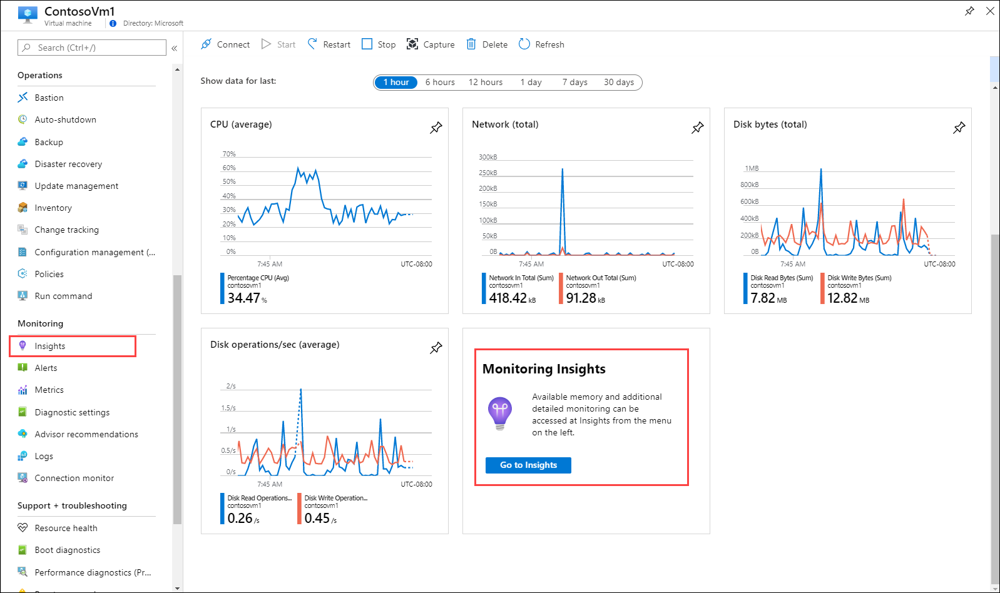
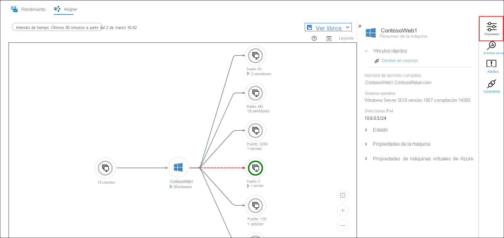

# Supervisión de máquinas virtuales de Azure con Azure Monitor.
[Azure Monitor](../overview.md) comienza a recopilar datos de las máquinas virtuales de Azure en el momento en que se crean. En este inicio rápido se proporciona un breve tutorial de los datos que se recopilan automáticamente para una máquina virtual de Azure y de cómo verlos en Azure Portal. Después, habilitará [VM Insights](../vm/vminsights-overview.md) para la máquina virtual, lo que permitirá a los agentes de la máquina virtual recopilar y analizar datos del sistema operativo invitado, incluidos los procesos y sus dependencias.

En esta guía de inicio rápido se da por supuesto que tiene una máquina virtual de Azure. De no ser así, puede crear una [máquina virtual Windows](../../virtual-machines/windows/quick-create-portal.md) o [Linux](../../virtual-machines/linux/quick-create-cli.md) con los pasos que se describen en nuestros inicios rápidos para máquinas virtuales.

Para obtener descripciones más detalladas de los datos de supervisión recopilados de los recursos de Azure, consulte [Supervisión de máquinas virtuales de Azure con Azure Monitor](./monitor-vm-azure.md).

## Completar el inicio rápido de la supervisión de recursos de Azure
Complete [Supervisión de recursos de Azure con Azure Monitor](../essentials/quick-monitor-azure-resource.md) para ver la página de información general, el registro de actividad y las métricas de una máquina virtual de su suscripción. Las máquinas virtuales de Azure recopilan los mismos datos de supervisión que cualquier otro recurso de Azure, pero esto sucede solo para la máquina virtual de host. El resto de este inicio rápido se centrará en la supervisión del sistema operativo invitado y sus cargas de trabajo.

## Habilitación de VM Insights
Mientras se recopilan las métricas y los registros de actividad para la máquina virtual de host, necesita un agente y algunas configuraciones para recopilar y analizar los datos de supervisión del sistema operativo invitado y sus cargas de trabajo. VM Insights instala estos agentes y proporciona características adicionales eficaces para la supervisión de las máquinas virtuales.

1. Vaya al menú de la máquina virtual.
2. Haga clic en **Ir a Insights** en el icono de la página **Introducción** o haga clic en **Insights** en el menú **Supervisión**.

    

3. Si todavía no se ha habilitado VM Insights para la máquina virtual, haga clic en **Habilitar**. 

    

4. Si la máquina virtual no está aún conectada a un área de trabajo de Log Analytics, se le pedirá que seleccione un área de trabajo existente o que cree una. Seleccione el valor predeterminado que es un área de trabajo con un nombre único en la misma región que la máquina virtual.

    

5. La incorporación tardará unos minutos, ya que las extensiones se habilitan y los agentes se instalan en la máquina virtual. Cuando haya finalizado, recibirá un mensaje que indica que Insights se ha implementado correctamente. Haga clic en **Azure Monitor** para abrir VM Insights.

    

6. Verá que están incorporadas la máquina virtual con otras máquinas virtuales de la suscripción. Seleccione la pestaña **Sin supervisión** si desea ver las máquinas virtuales de la suscripción que no están incorporadas.

    

## Configuración del área de trabajo
Al crear una nueva área de trabajo de Log Analytics, es necesario configurarla para recopilar registros. Esta configuración solo se debe realizar una vez, ya que se envía a cualquier máquina virtual que se conecte a ella.

1. Seleccione **Configuración del área de trabajo** y después el área de trabajo.

2. Seleccione **Configuración avanzada**.

    

### Recopilación de datos de VM Windows

2. Seleccione **Datos** y, a continuación, **Registros de eventos de Windows**.

3. Para agregar un registro de eventos, escriba el nombre del registro.  Escriba **Sistema** y, luego, seleccione el signo más **+** .

4. En la tabla, compruebe los niveles de gravedad **Error** y **Advertencia**.

5. Seleccione **Guardar** en la parte superior de la página para guardar la configuración.

### Recopilación de datos de VM Linux

1. Seleccione **Datos** y, después, seleccione **Syslog**.

2. Para agregar un registro de eventos, escriba el nombre del registro.  Escriba **Syslog** y, luego, seleccione el signo más **+** .  

3. En la tabla, deseleccione los niveles de gravedad **Información**, **Aviso** y **Depurar**. 

4. Seleccione **Guardar** en la parte superior de la página para guardar la configuración.

## Ver datos recopilados

7. Haga clic en la máquina virtual y seleccione la pestaña **Rendimiento** situada bajo el icono **Insights** del menú **Supervisión**. Esto muestra un grupo seleccionado de contadores de rendimiento recopilados del sistema operativo invitado de la máquina virtual. Desplácese hacia abajo para ver más contadores, y mueva el mouse sobre un gráfico para ver el promedio y los percentiles en momentos diferentes.

    

9. Seleccione **Mapa** para abrir la característica de mapas que muestra los procesos que se ejecutan en la máquina virtual y sus dependencias. Seleccione **Propiedades** para abrir el panel de propiedades si aún no está abierto.

    

11. Expanda los procesos de la máquina virtual. Seleccione uno de los procesos para ver sus detalles y resaltar sus dependencias.

    

12. Vuelva a seleccionar la máquina virtual y, luego, seleccione **Registrar eventos**. 

    

13. Verá una lista de tablas que se almacenan en el área de trabajo de Log Analytics de la máquina virtual. Esta lista será diferente en función de si usa una máquina virtual Windows o Linux. Haga clic en la tabla **Evento**. Esto incluye todos los eventos del registro de eventos de Windows. Se abre Log Analytics con una consulta simple para recuperar las entradas del registro de eventos.

    

## Pasos siguientes
En este inicio rápido, ha habilitado VM Insights para una máquina virtual y ha configurado el área de trabajo de Log Analytics para recopilar eventos del sistema operativo invitado. Para obtener información sobre cómo ver y analizar los datos, continúe con el tutorial.

> [!div class="nextstepaction"]
> [Ver o analizar datos en Log Analytics](../logs/log-analytics-tutorial.md)