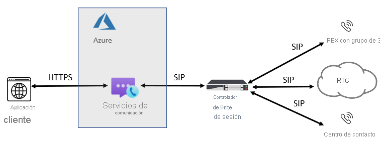

# Conceptos de telefonía

[!INCLUDE [Private Preview Notice](../../includes/private-preview-include.md)]

Las bibliotecas cliente de llamada de Azure Communication Services se pueden usar para agregar telefonía y RTC a las aplicaciones. En esta página se resumen las funcionalidades y los conceptos clave de la telefonía. Para más información sobre los lenguajes y funcionalidades específicos de la biblioteca cliente, consulte la [biblioteca de llamada](../../quickstarts/voice-video-calling/calling-client-samples.md).

## Introducción a la telefonía
Siempre que los usuarios interactúan con un número de teléfono tradicional, las llamadas se facilitan mediante llamadas de voz de RTC (red telefónica conmutada). Para hacer y recibir llamadas RTC, tiene que agregar funcionalidades de telefonía a su recurso de Azure Communication Services. En este caso, las señales y los elementos multimedia usan una combinación de tecnologías basadas en IP y en RTC para conectar a los usuarios. Communication Services proporciona dos formas discretas de acceder a la red de RTC: Azure Cloud Calling e interfaz SIP.

### Azure Cloud Calling

Una manera sencilla de agregar conectividad RTC a una aplicación o servicio, en este caso, Microsoft es su proveedor de telecomunicaciones. Puede comprar números directamente a Microsoft. Azure Cloud Calling es una solución de telefonía todo en la nube para Communication Services. Es la opción más sencilla para conectar ACS a la red telefónica conmutada (RTC) pública para habilitar las llamadas a teléfonos fijos y móviles de todo el mundo. Con esta opción, Microsoft actúa como operador de RTC, como se muestra en el diagrama siguiente:

Si responde afirmativamente a las siguientes afirmaciones, Azure Cloud Calling es la solución más adecuada para usted:
- Azure Cloud Calling está disponible en su región.
- No es preciso que siga utilizando el operador de RTC actual.
- Quiere usar el acceso administrado por Microsoft a la RTC.

Con esta opción:
- Obtiene los números directamente de Microsoft y puede llamar a teléfonos de todo el mundo.
- No se requiere la implementación ni el mantenimiento de una implementación local, ya que Azure Cloud Calling funciona fuera de Azure Communication Services.
- Nota: si fuera necesario, puede conectar un controlador de borde de sesión (SBC) compatible a través de la interfaz SIP para lograr interoperabilidad con las PBX de terceros, dispositivos analógicos y otros equipos de telefonía de terceros compatibles con el SBC.

Esta opción requiere una conexión ininterrumpida a Azure Communication Services.

### Interfaz SIP

Con esta opción, puede conectar tanto la telefonía local heredada como el operador que prefiera a Azure Communication Services. Proporciona funcionalidades de llamada RTC a las aplicaciones de ACS, aunque Azure Cloud Calling no esté disponible en su país o región. 

Si su respuesta es afirmativa a cualquiera de las siguientes preguntas, la interfaz SIP es la solución adecuada para usted:

- Quiere usar ACS con las funcionalidades de llamada RTC.
- Necesita seguir usando el operador de RTC actual.
- Desea mezclar el enrutamiento, es decir, que algunas llamadas vayan por Azure Cloud Calling y otras por el operador de telefonía.
- Necesita interoperar con PBX de terceros o con equipos como buscapersonas, dispositivos analógicos, etc.

Con esta opción:

- Puede conectar su propio SBC compatible a Azure Communication Services sin necesidad de software local adicional.
- Puede usar literalmente todos los operadores de telefonía con ACS.
- Si lo desea, puede optar por configurar y administrar esta opción, o bien puede encargarse de ello su operador o asociado (pregunte si ambos ofrecen esta opción)
- Puede configurar la interoperabilidad entre el equipo de telefonía, como un PBX de terceros y dispositivos analógicos, y ACS.

Esta opción requiere los siguiente elementos:

- Conexión ininterrumpida a Azure.
- Implementación y mantenimiento de un SBC compatible.
- Un contrato con un operador de terceros (salvo que se implemente como una opción para proporcionar conexión con una PBX de terceros, dispositivos analógicos u otro equipo de telefonía para los usuarios que se encuentran en Communication Services).

## Pasos siguientes

### Documentación conceptual

- [Tipos de número de teléfono en Azure Communication Services](./plan-solution.md)
- [Planeamiento de la interfaz SIP](./sip-interface-infrastructure.md)
- [Precios](../pricing.md)

### Guías de inicio rápido

- [Obtención de un número de teléfono](../../quickstarts/telephony-sms/get-phone-number.md)
- [Llamada a teléfono](../../quickstarts/voice-video-calling/pstn-call.md)
