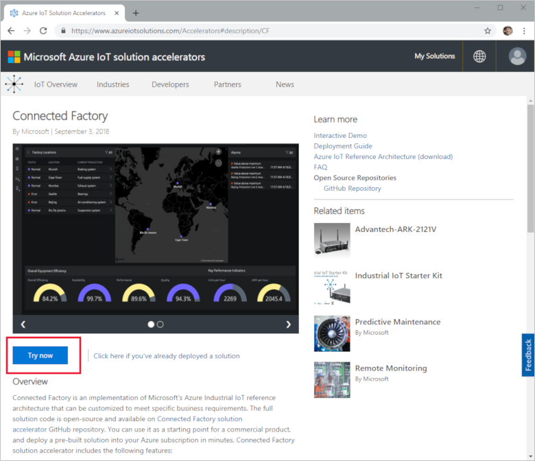
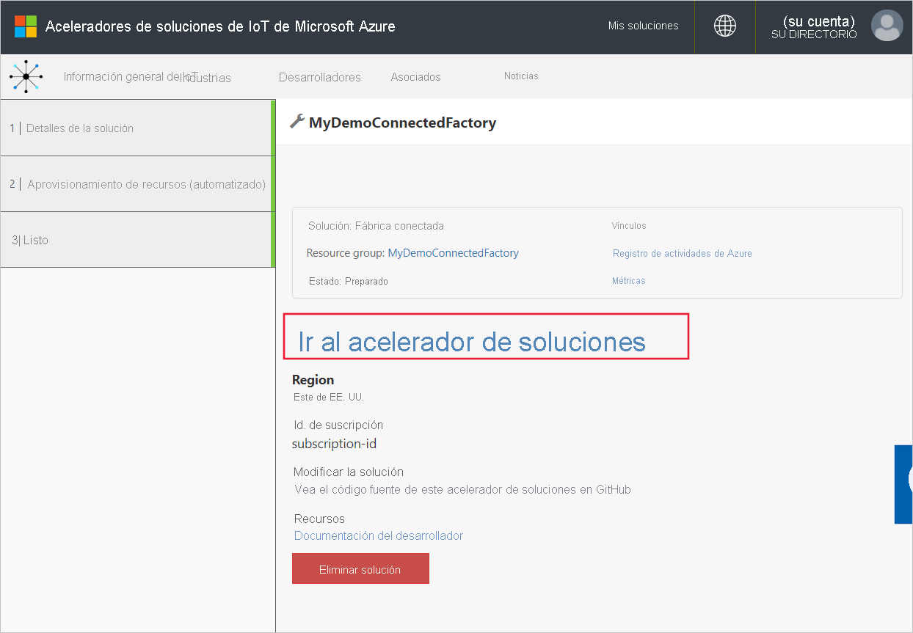
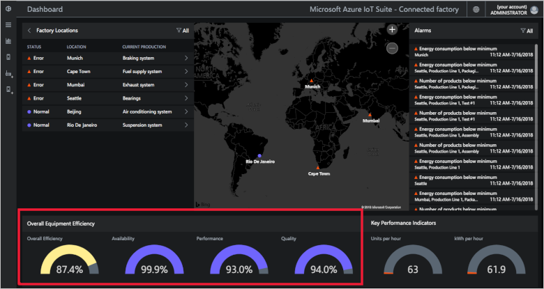
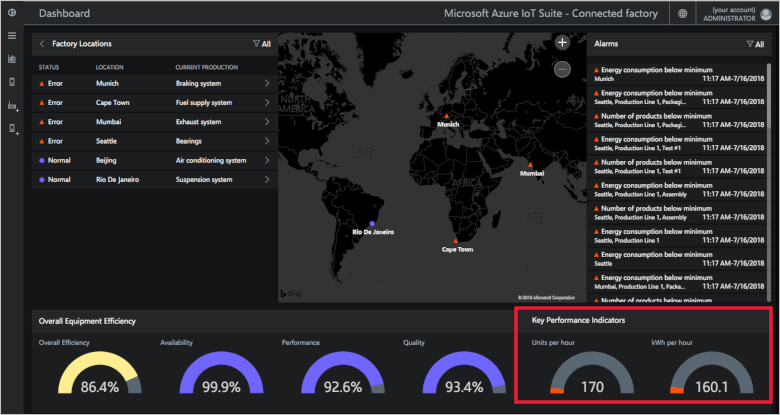
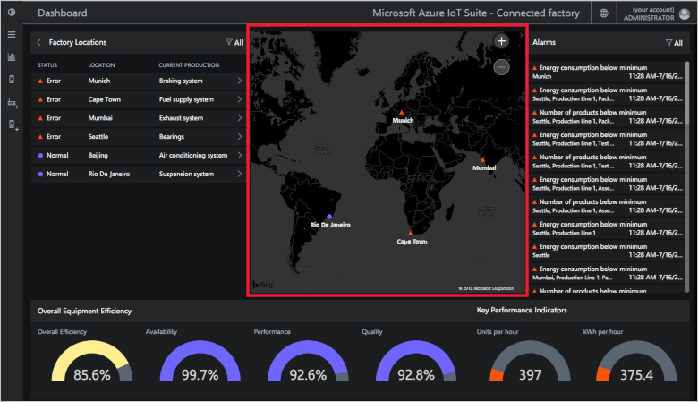
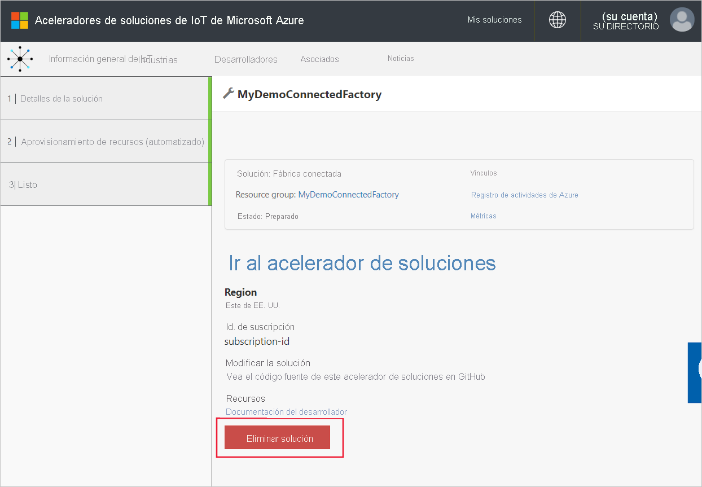

# Inicio rápido: Prueba de una solución basada en la nube para administrar los dispositivos IoT industriales

En este inicio rápido se muestra cómo implementar la solución Connected Factory de Azure IoT para ejecutar una simulación de administración y supervisión basada en la nube para dispositivos IoT industriales. Al implementar el acelerador de soluciones Connected Factory, se rellena previamente con recursos que le permiten recorrer un escenario IoT industrial común. En él, varias fábricas conectadas a la solución informan de los valores de datos necesarios para calcular la eficiencia general de los equipos (OEE) y los indicadores clave de rendimiento (KPI). En este inicio rápido se muestra cómo usar el panel de soluciones para realizar las siguientes tareas:

* Supervisar los valores de la fábrica, de las líneas de producción, de OEE de las estaciones y de KPI
* Analizar los datos de telemetría generados desde estos dispositivos
* Responder a las alarmas

Para completar esta guía de inicio rápido, necesita una suscripción de Azure.

Si no tiene una suscripción a Azure, cree una [cuenta gratuita](https://azure.microsoft.com/free/?WT.mc_id=A261C142F) antes de empezar.

## Implementación de la solución

Al implementar el acelerador de soluciones para la suscripción de Azure, debe establecer algunas opciones de configuración.

Vaya a [aceleradores de soluciones de IoT de Microsoft Azure](https://www.azureiotsolutions.com) e inicie sesión con las credenciales de la cuenta de Azure.

Haga clic en el icono **Fábrica conectada**. En la página **Fábrica conectada**, haga clic en **Probar ahora**:

En la página **Create Connected Factory solution** (Crear solución Connected Factory), escriba un **nombre de solución** único para su acelerador de soluciones Connected Factory. Este nombre es el nombre del grupo de recursos de Azure que contiene todos los recursos del acelerador de soluciones. Esta guía de inicio rápido usa el nombre **MyDemoConnectedFactory**.

Seleccione la **Suscripción** y la **Región** que desea usar para implementar el acelerador de soluciones. Generalmente, elegirá la región más cercana. En esta guía de inicio rápido, vamos a usar **Visual Studio Enterprise** y **Este de EE. UU**. Debe ser un [administrador global o un usuario](iot-accelerators-permissions.md) en la suscripción.

Haga clic en **Crear** para iniciar la implementación. Este proceso tarda al menos cinco minutos en ejecutarse:

## Inicio de sesión en la solución

Una vez completada la implementación en su suscripción de Azure, verá una marca de verificación verde y **Listo** en el icono de la solución. Ahora puede iniciar sesión en el panel del acelerador de soluciones Connected Factory.

En la página **Soluciones aprovisionadas**, haga clic en el nuevo acelerador de soluciones Connected Factory:

Puede consultar información sobre el acelerador de soluciones Connected Factory en la página que aparece. Elija **Go to your Solution accelerator** (Ir al acelerador de soluciones) para ver el acelerador de soluciones Connected Factory:

Haga clic en **Aceptar** para aceptar la solicitud de permisos; el panel de soluciones Connected Factory se muestra en el explorador. En él aparece un conjunto de fábricas, líneas de producción y estaciones simuladas.

## Ver el panel

La vista predeterminada es el *panel*. Use el menú de la parte izquierda de la página para ir a otras áreas del portal:

Usará el panel para administrar los dispositivos IoT industriales. Connected Factory usa una jerarquía para mostrar una configuración de fábrica global. El nivel superior de la jerarquía es la empresa, que a su vez contiene una o varias fábricas. Cada fábrica contiene líneas de producción y cada línea de producción se compone de estaciones. En cada nivel, puede ver valores de OEE y KPI, publicar nuevos nodos para telemetría y responder a las alarmas.

En el panel puede ver:

## Eficiencia general del equipo

Un panel **Eficiencia general del equipo** muestra los valores de OEE de toda la empresa o de la fábrica, línea de producción o estación que esté visualizando. Este valor se agrega desde la vista de estación hasta el nivel de empresa. La cifra de OEE y sus elementos constituyentes se pueden analizar aún más.

OEE evalúa la eficiencia del proceso de fabricación mediante parámetros de operaciones clave relacionados con la producción. OEE es una medida estándar de la industria que se calcula multiplicando la tasa de disponibilidad, la tasa de rendimiento y la tasa de calidad: OEE = disponibilidad x rendimiento x calidad.

Puede analizar más a fondo los valores de OEE de cualquier nivel de datos de la jerarquía. Haga clic en la esfera de OEE, disponibilidad, rendimiento o porcentaje de calidad. Aparece un panel contextual con visualizaciones que muestran datos a lo largo de diferentes escalas de tiempo:

Puede hacer clic en un gráfico para analizar los datos más a fondo.

### Indicadores clave de rendimiento

El panel **Indicadores clave de rendimiento** muestra el número de unidades producidas por hora y energía (kWh) usadas por toda la empresa o por la fábrica, línea de producción o estación que esté visualizando. Estos valores se agregan desde la vista de estación hasta el nivel de empresa.

Puede analizar más a fondo los valores de KPI de cualquier nivel de datos de la jerarquía. Haga clic en la esfera de OEE, disponibilidad, rendimiento o porcentaje de calidad. Aparece un panel contextual con visualizaciones que muestran datos a lo largo de diferentes escalas de tiempo:

Puede hacer clic en un gráfico para analizar los datos más a fondo.

### Ubicaciones de factoría

Un panel **Ubicaciones de factoría** que muestra el estado, la ubicación y la configuración actual de producción de la solución. La primera vez que se ejecuta el acelerador de soluciones, el panel muestra un conjunto simulado de fábricas. Cada simulación de una línea de producción consta de tres servidores OPC UA reales que ejecutan tareas simuladas y comparten datos. Para más información sobre OPC UA, consulte las [preguntas frecuentes sobre Connected Factory](iot-accelerators-faq-cf.md):

Puede navegar por la jerarquía de soluciones y ver los valores de OEE y KPI en cada nivel:

1. En **Ubicaciones de factoría**, haga clic en **Mumbai**. Verá las líneas de producción en esta ubicación.

1. Haga clic en **Production Line 1** (Línea de producción 1). Verá las estaciones de esta línea de producción.

1. Haga clic en **Empaquetado**. Verá los nodos de OPC UA publicados por esta estación.

1. Haga clic en **EnergyConsumption**. Verá algunos gráficos que representan este valor a lo largo de diferentes escalas de tiempo. Puede hacer clic en un gráfico para analizar los datos más a fondo.

### Asignación

Si su suscripción tiene acceso a la [API de Bing Maps](iot-accelerators-faq-cf.md), el mapa *Fábricas* muestra la ubicación geográfica y el estado de todas las fábricas incluidas en la solución. Haga clic en las ubicaciones que se muestran en el mapa para profundizar en los detalles de ubicación.

### Alarmas

El panel **Alarmas** muestra las alarmas generadas cuando un valor notificado o un valor de OEE o KPI calculado supera un umbral. Este panel muestra las alarmas en cada nivel de la jerarquía, desde el nivel de estación a la empresa. Cada alarma incluye una descripción, la fecha, la hora, la ubicación y el número de repeticiones:

Puede analizar los datos que provocaron la alarma desde el panel. Los administradores pueden realizar acciones predeterminadas sobre las alarmas, tales como:

* Cierre la alarma.
* Confirme la alarma.

Haga clic en una de las alarmas, en la lista desplegable **Elegir acción**, elija **Confirmar alerta** y, a continuación, haga clic en **Aplicar**:

Para analizar con mayor profundidad los datos de la alarma, haga clic en el gráfico del panel de la alarma.

Estas alarmas las generan reglas que se especifican en un archivo de configuración del acelerador de soluciones. Estas reglas pueden generar alarmas cuando las cifras de OEE o KPI o los valores de nodo de OPC UA superan un umbral. Puede establecer este valor de umbral.

## Limpieza de recursos

Si tiene previsto explorar más a fondo, deje implementado el acelerador de soluciones Connected Factory.

Si ya no necesita el acelerador de soluciones, elimínelo de la página [Soluciones aprovisionadas](https://www.azureiotsolutions.com/Accelerators#dashboard). Para ello, selecciónelo y, a continuación, haga clic en **Eliminar solución**:

## Pasos siguientes

En este inicio rápido, implementó el acelerador de soluciones Connected Factory y aprendió a navegar por las fábricas, las líneas de producción y las estaciones. También ha visto cómo visualizar los valores de OEE y KPI en cualquier nivel de la jerarquía y cómo responder a las alarmas.

Para saber cómo usar otras características del panel para administrar los dispositivos IoT industriales, continúe con la siguiente guía de procedimientos:

> [!div class="nextstepaction"]
> [Uso del panel de Connected Factory](iot-accelerators-connected-factory-dashboard.md)