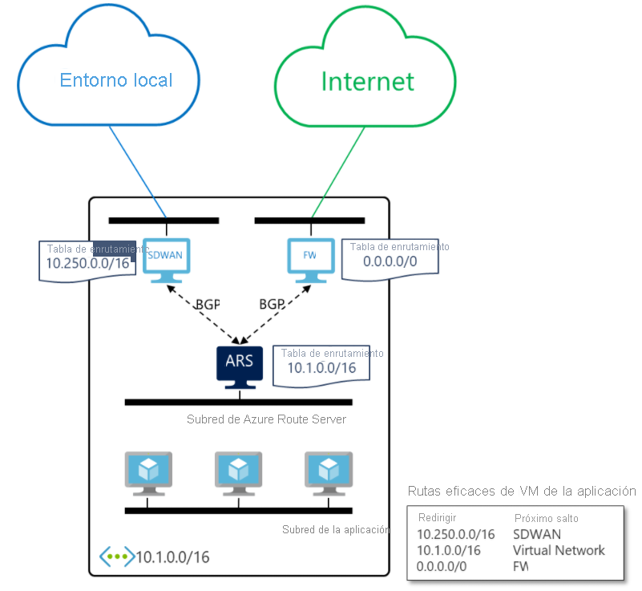

# ¿Qué es Azure Route Server (versión preliminar)? 

Azure Route Server simplifica el enrutamiento dinámico entre la aplicación virtual de red (NVA) y la red virtual. Permite intercambiar información de enrutamiento directamente mediante el protocolo de enrutamiento BGP (Protocolo de puerta de enlace de borde) entre cualquier NVA que admita el protocolo de enrutamiento BGP y la red definida por software (SDN) de Azure en la red virtual de Azure (VNET) sin necesidad de configurar ni mantener manualmente las tablas de rutas. Azure Route Server es un servicio totalmente administrado y está configurado con alta disponibilidad.

> [!IMPORTANT]
> Azure Route Server (versión preliminar) está actualmente en versión preliminar pública.
> Esta versión preliminar se ofrece sin Acuerdo de Nivel de Servicio y no se recomienda para cargas de trabajo de producción. Es posible que algunas características no sean compatibles o que tengan sus funcionalidades limitadas.
> Para más información, consulte [Términos de uso complementarios de las Versiones Preliminares de Microsoft Azure](https://azure.microsoft.com/support/legal/preview-supplemental-terms/).

## ¿Cómo funciona?

En el siguiente diagrama se ilustra cómo funciona Azure Route Server con una NVA SDWAN y una NVA de seguridad en una red virtual. Una vez que haya establecido el emparejamiento de BGP, Azure Route Server recibirá una ruta local (10.250.0.0/16) del dispositivo SDWAN y una ruta predeterminada (0.0.0.0/0) del firewall. A continuación, estas rutas se configuran automáticamente en las máquinas virtuales de la red virtual. Como resultado, todo el tráfico destinado a la red local se enviará al dispositivo SDWAN. Por otro lado, todo el tráfico relacionado con Internet se enviará al firewall. En la dirección opuesta, Azure Route Server enviará la dirección de la red virtual (10.1.0.0/16) a ambas NVA. El dispositivo SDWAN puede propagarlo a la red local.

## Ventajas principales 

Azure Route Server simplifica la configuración, la administración y la implementación de la NVA en la red virtual.  

* Ya no es necesario actualizar manualmente la tabla de enrutamiento en la NVA cada vez que se actualicen las direcciones de la red virtual. 

* Ya no es necesario actualizar manualmente las [rutas definidas por el usuario](../virtual-network/virtual-networks-udr-overview.md) cada vez que la NVA anuncie nuevas rutas o retire las anteriores. 

* Puede emparejar varias instancias de su NVA con Azure Route Server. Puede configurar los atributos BGP en la NVA y, en función del diseño (por ejemplo, activo-activo para el rendimiento o activo-pasivo para la resistencia), permitir que Azure Route Server sepa qué instancia de NVA es activa o pasiva. 

* La interfaz entre la NVA y Azure Route Server se basa en un protocolo estándar común. Siempre que la NVA admita BGP, puede emparejarla con Azure Route Server. Para más información, consulte [Protocolos de enrutamiento admitidos por Route Server](route-server-faq.md#protocol).

* Puede implementar Azure Route Server en cualquiera de las redes virtuales nuevas o existentes. 

## Preguntas más frecuentes

Para ver las preguntas más frecuentes sobre Azure Route Server, consulte [Preguntas frecuentes sobre Azure Route Server](route-server-faq.md).

## Pasos siguientes

- [Consultar cómo configurar Azure Route Server](quickstart-configure-route-server-powershell.md)
- [Compatibilidad de Azure Route Server (versión preliminar) con ExpressRoute y VPN de Azure](expressroute-vpn-support.md)
