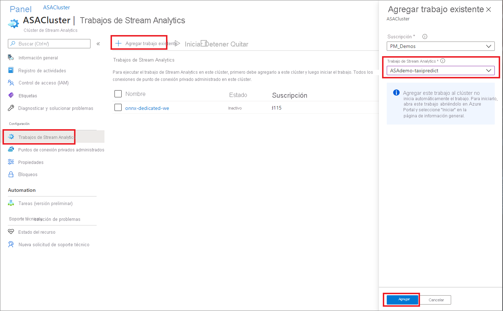
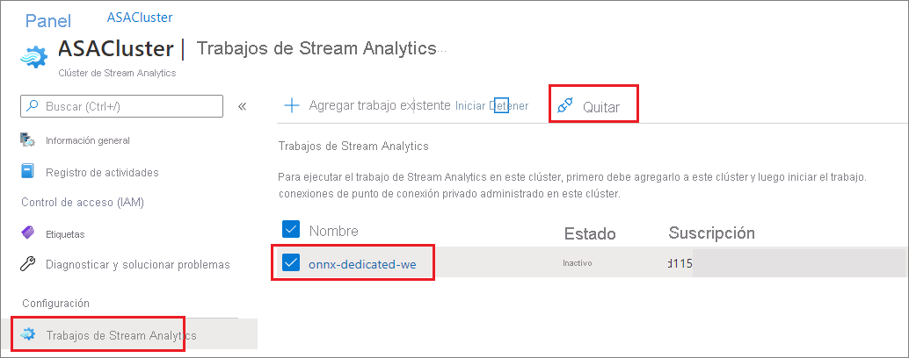

# Adición y eliminación de trabajos en un clúster de Azure Stream Analytics

Puede ejecutar varios trabajos de Azure Stream Analytics en un clúster de Stream Analytics. Ejecutar trabajos en un clúster es un proceso sencillo de 2 pasos, en el que debe agregar el trabajo al clúster y, luego, iniciar dicho trabajo. En este artículo se muestra cómo agregar y quitar trabajos de un clúster existente. Siga el inicio rápido para [crear un clúster de Stream Analytics](create-cluster.md) si aún no tiene ninguno.

## Adición de un trabajo de Stream Analytics a un clúster

Solo se pueden agregar trabajos de Stream Analytics existentes a los clústeres. Siga el inicio rápido para [obtener información sobre cómo crear un trabajo](stream-analytics-quick-create-portal.md) mediante Azure Portal. Una vez que tenga un trabajo que quiera agregar a un clúster, siga estos pasos para agregar dicho trabajo al clúster.

1. En Azure Portal, busque y seleccione el clúster de Stream Analytics.

1. En **Configuración**, seleccione **Trabajos de Stream Analytics**. Luego, seleccione **Agregar trabajo existente**.

1. Seleccione la suscripción y el trabajo de Stream Analytics que quiere agregar al clúster. Solo se pueden agregar al clúster los trabajos de Stream Analytics que se encuentran en la misma región que el clúster.

   

1. Después de agregar el trabajo al clúster, vaya al recurso del trabajo e [inicie el trabajo](start-job.md#azure-portal). Dicho trabajo comenzará a ejecutarse en el clúster.

Puede realizar todas las demás operaciones, como la supervisión, la creación de alertas y los registros de diagnóstico, desde la página de recursos del trabajo de Stream Analytics.

## Eliminación de un trabajo de Stream Analytics de un clúster

Los trabajos de Stream Analytics deben encontrarse en estado detenido para que se puedan quitar del clúster. Si su trabajo todavía se está ejecutando, deténgalo antes de continuar con los pasos siguientes.

1. Busque y seleccione su clúster de Stream Analytics.

1. En **Configuración**, seleccione **Trabajos de Stream Analytics**.

1. Seleccione los trabajos que quiere quitar del clúster y, luego, seleccione **Quitar**.

   

   Cuando se quita un trabajo de un clúster de Stream Analytics, este vuelve al entorno de varios inquilinos estándar.

## Pasos siguientes

Ahora sabe cómo agregar y quitar trabajos en el clúster de Azure Stream Analytics. A continuación, puede obtener información sobre cómo administrar puntos de conexión privados y escalar los clústeres:

* [Escalado de un clúster de Azure Stream Analytics](scale-cluster.md)
* [Administración de puntos de conexión privados en un clúster de Azure Stream Analytics](private-endpoints.md)
